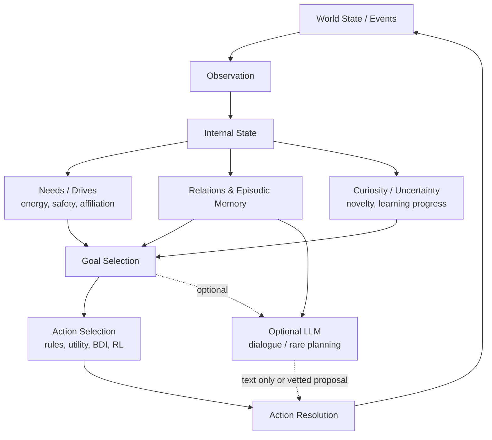

# 欲望AI／人工世界の先行研究・公開実装 横断調査

**調査日:** 2026年8月18日  
**対象:** 欲求・恒常性・内発的動機づけ・好奇心・能動的推論・自律的目標生成・記憶駆動行動・人工生命・社会シミュレーション  
**判断の前提:** 本稿の「欲望」は主観的経験の有無を意味しない。ここでは、持続する内部状態が世界の観測と時間経過で変化し、その状態が目標・行動選択・学習へ因果的に効く**行動機構**を指す。

> **結論:** 個人開発の小さな人工世界で最も費用対効果が高いのは、**数値の needs／drives、離散的な世界状態、規則ベースの行動選択、上限付きのエピソード記憶**を常時実行し、発話または希少な再計画にだけ軽量LLMを使う構成である。これは研究上の新奇性を追うためではなく、20〜100 NPCで「世界が先に動き、言葉は後から付く」状態を作るための判断である。

---

## 1. Executive Summary

### 1.1 現在どこまで実装可能か

「欲望を持っているように振る舞うAI」は、少なくとも**Level 2〜4**の範囲では十分に実装可能である。すなわち、空腹・疲労・安全・社会的孤立・好奇心などを持続状態として保持し、時間と出来事で更新し、不満足度の大きい状態を回復する目標を選び、経験を通じて相手への信頼や行動価値を変化させる仕組みである。ホームオスタティック強化学習は、内部状態の目標値からの偏差を drive と定義し、その低減を報酬として行動学習へ接続する明快な定式化を与える。[11] [12]

一方で、**設計者が定義していない新しい「欲求」そのものが安定して発生すること**は、現行研究で強く実証されたとは言いにくい。IMGEPのような内発的目標探索は、与えられた／学習された目標空間から自ら目標をサンプリングし、学習進捗に応じて探索課題を変える。[24] これは二次的な目標や技能列の創発には近いが、価値体系そのものが自律的に形成・維持されることの証明ではない。したがって本調査では、Level 5を安易に認定しない。

### 1.2 OSSで実際に試す価値が高いもの

最も直接的な参照実装は、LLMベースながら欲求値を明示的に扱う **D2A** である。D2Aは複数の desire を0〜10の値として扱い、期待値との差を追跡し、候補行動の生成・結果の想像・選択にLLMを用いる。[3] [5] ただし、これは小規模なテキスト社会シミュレーション向けで、常時稼働する多数NPCの土台としては重い。

LLM不要の核を試すなら、**Mesa**、**MASON**、**NetLogo**のようなエージェントベース・モデリング基盤、あるいは直接実装する小さなゲームループが有力である。MesaはPythonでエージェント、スケジューラ、空間、ブラウザ可視化を組み立てられる。[20] MASONは軽量・高速なJavaの離散イベント型マルチエージェント基盤で、大規模カスタムシミュレーションを用途に掲げる。[26] ただし、いずれも欲求モデルを提供するのではなく、世界の実行基盤である。

### 1.3 LLMが不要な部分と、使うべき部分

次の循環はLLMを必要としない。

```text
world event / time
  → observation
  → numeric needs, emotion, relation, memory update
  → goal scoring
  → rule / utility / pathfinding action
  → world state update
```

ホームオスタシス、簡易好奇心、信頼、恐怖、習慣、短期記憶、行動候補のスコアリング、対人関係の更新、経路探索、行動の解決は、すべて離散状態・数値・規則・確率で実装できる。LLMが特に有用なのは、状態の**説明可能な発話への変換**、珍しい局面での物語的な計画候補、開発者向けのログ要約である。行動理由の生成と行動決定を分けることが、規模・デバッグ性・再現性の境界になる。

### 1.4 Mintwhirl Islandへの推奨

Mintwhirl IslandのIssue #2が置く成功条件、すなわち「プレイヤーが何もしなくても住民同士で出来事が起こり、観察者が『何か始めた』と感じること」は、重量級LLMを全員に載せずとも達成できる。[1] 最初の実装では、**空腹・好奇心・警戒（fear）・親和／trust**の4変数、数件の重み付きエピソード記憶、6〜10個の原子的行動、近傍イベントの伝播だけでよい。世界を先に自走させ、発話はその結果を数語で可視化する補助層に留めるべきである。

| 判断 | 推奨 |
|---|---|
| 常時の意思決定 | 数値 drive + utility / rule-based action |
| 記憶 | 容量上限のあるエピソード記憶 + 関係性行列 |
| 世界の更新 | 固定tickまたはイベント駆動。NPCの思考頻度を分離 |
| 発話 | テンプレート／Markov／確率選択を基本にし、LLMは任意 |
| LLM計画 | イベント発生時、長い膠着時、または少数の主役NPCに限定 |
| 100 NPC | 数値モデルを必須化。LLMを毎tick・毎NPCに使わない |

---

## 2. Concept Map

以下の概念は相互に接続するが、同義ではない。**need / drive** は保つべき状態または不足の指標、**homeostasis** は望ましい範囲へ戻す制御原理、**intrinsic motivation** は外部タスク報酬ではない内部報酬、**curiosity** はその一部として新規性・予測誤差・学習進捗を選好する仕組みである。**active inference** は好ましい状態を事前信念としてもち、観測と行為の双方で予測誤差を減らす枠組みであり、特定のゲーム実装を要求しない。[18]



### 2.1 設計上の使い分け

| 概念 | 行動上の意味 | 最小実装 | 人工世界への価値 | 注意点 |
|---|---|---|---|---|
| Need / Drive | 「今、満たしたい」偏差 | `value`, `target`, `decay`, `weight` | 行動に継続理由を与える | 値を増やしすぎると調整不能になる |
| Homeostasis | 偏差を安全域へ戻す | 距離 `abs(value-target)` の最小化 | 空腹、疲労、安全を自然に扱える | 単調な最短行動に固定化しやすい |
| Allostasis | 将来の不足を予測して先回り | 予測された将来driveを加点 | 食料確保、避難、約束準備 | 予測モデルは簡単な規則から始める |
| Intrinsic motivation | 外部報酬以外の内部報酬 | 新規性／成功率変化の加点 | 探索や技能練習を生む | 無制限の新規性は「ノイズ嗜好」になる |
| Curiosity | 未知・情報価値への選好 | 未訪問セル、未遭遇相手、予測誤差 | 島の自主探索を生む | 安全・空腹より常に強くしない |
| Active inference | 好ましい状態と観測の不一致を減らす | 選好状態と予測コストの比較 | 「不確実性を下げたい」を追加できる | 数学全体を導入する必要はない |
| BDI | belief, desire, intention の分離 | 信念、目標、実行中プラン | 複数目標の実行中断・再開 | desireを数値的にする設計は別途必要 |
| Memory-driven behavior | 過去の出来事が選好を変える | エピソード + relation score | trust、fear、習慣を形成 | 無制限メモリは検索・因果が崩れる |
| Autonomous goal generation | 次の課題を内部から選ぶ | goal templateの重み付き生成 | 「何をするか」を命令なしに決める | goal spaceと安全制約は設計者が与える |

### 2.2 「欲望らしさ」の判定基準

| Level | 定義 | この調査での代表例 | 評価上の注意 |
|---|---|---|---|
| 0 | Persona only。プロンプト上の性格のみ | 「あなたは好奇心旺盛」と書かれた会話bot | 持続状態がなければ欲求機構ではない |
| 1 | Reactive preference。現在入力への選好 | 単発のLLMロールプレイ | 入力外の時間で変化しない |
| 2 | Persistent drive。時間・イベントで変化する内部値 | D2Aの数値desire、単純な空腹ゲージ | まだ目標生成へつながるとは限らない |
| 3 | Drive → Goal。内部値から行動・目標が選ばれる | D2A、ホームオスタティックRL、pymdp、MicroPsi | 本調査の「自走」最低ライン |
| 4 | Adaptive preference。経験・記憶で優先度や行動価値が変わる | MicroPsiの記憶強化、IMGEPの学習進捗、関係性学習 | 欲求そのものの更新と、行動価値更新を区別する |
| 5 | Emergent / self-generated drives | 強い実証例は本調査で確認できず | 自己生成した目標空間を欲求生成と混同しない |

---

## 3. Landscape：有力研究・実装の比較

**評価記号:** LLMは「必須／任意／不要」、ローカル実行は「yes／partial／no」。欲望Levelは本調査の分類であり、原著者がそのラベルを主張したものではない。OSS欄の「なし」は、該当する原理の公開実装が本調査で確認できなかったことを示す。

| Project / Paper | 年 | Category | Architecture / 持続状態 | 自律行動・Memory | LLM | OSS / License / Language | Local / Browser | Cost | Level・Mintwhirl適性 |
|---|---:|---|---|---|---|---|---|---|---|
| D2A [3] [5] | 2025 | desire / needs | 多次元Value System、期待値との差、候補活動の比較 | yes / 連想記憶 | 必須 | yes / MIT / Python | partial / 低 | 高 | L3・中 |
| Generative Agents [7] [8] | 2023 | memory / social sim | 自然言語memory stream、reflection、日次計画 | yes / 長期 | 必須 | yes / Apache-2.0 / Python+JS | yes / 中 | 高 | L1–3*・中 |
| Concordia [9] [10] | 2023– | social simulation | Entity components、連想記憶、Game Master | yes / 長期可 | 必須 | yes / Apache-2.0 / Python | yes / 低 | 高 | L1–3*・中 |
| Homeostatic RL [11] [12] | 2011/2014 | homeostasis / RL | 内部状態とsetpointの距離をdrive、drive低減を報酬化 | yes / 学習値 | 不要 | 原理中心 / — | yes / 高 | 低〜中 | L3・高 |
| ICM [13] [14] | 2017 | curiosity / RL | 自己教師あり予測誤差を内発報酬にする | yes / 方策・予測器 | 不要 | yes / license未明記 / Python(TF) | partial / 低 | 中 | L2–3・中 |
| RND [15] [16] | 2018 | novelty / RL | 固定ランダムネットへの予測誤差を新規性とする | yes / 予測器 | 不要 | yes / archived・license未明記 / Python | partial / 低 | 中 | L2–3・中 |
| pymdp [17] | 2022– | active inference | 離散MDP、選好状態、期待自由エネルギー、epistemic value | yes / 状態信念 | 不要 | yes / MIT / Python | yes / 低 | 低 | L3・中〜高 |
| Jason [19] | 継続 | BDI / goal | belief–desire–intention、イベントとプラン | yes / 信念・プラン | 不要 | yes / LGPL-3.0 / Java | yes / 低 | 低 | L3・中 |
| Mesa [20] | 継続 | ABM | AgentSet、空間、スケジューラ、可視化 | 実装次第 | 不要 | yes / Apache-2.0 / Python | yes / 高 | 低 | 基盤・高 |
| GAMA [21] | 継続 | spatial ABM / BDI | 空間ABM、BDI拡張、GUI・headless | 実装次第 | 不要 | yes / GPL-3.0 / Java | yes / 低 | 低〜中 | 基盤・中 |
| MicroPsi [22] [23] | 2003– | cognitive architecture | 身体値→urge、感情modulator、短長期記憶、計画 | yes / 長期 | 不要 | yes / license未明記 / Python | partial / partial | 低〜中 | L3、L4一部・高 |
| IMGEP [24] [25] | 2017– | intrinsic goal generation | 自己サンプル目標、学習進捗で選択、経験アーカイブ | yes / 経験蓄積 | 不要 | yes / GPL-3.0 / Python | partial / 低 | 中 | L4・中 |
| MASON [26] | 2003– | high-scale ABM | 離散イベント、2D/3D、Distributed MASON | 実装次第 | 不要 | yes / license要確認 / Java | yes / 低 | 低 | 基盤・中 |
| NetLogo [27] | 継続 | ABM / education | turtles, patches, links、NetLogo Web | 実装次第 | 不要 | yes / GPL-2.0 / Scala | yes / 高 | 低 | 基盤・中 |
| Creatures / openc2e [28] | 1996– | artificial life | 生化学・人工生命ゲームのエンジン再実装 | 部分的 / 状態あり | 不要 | yes / LGPL-2.1 / C++ | partial / 低 | 低 | L3系の歴史参照・低 |
| OpenCog / OpenPsi [29] | 2010年代 | cognitive architecture | 知識グラフ、心理状態・行動選択の研究系 | yes / グラフ | 不要 | 旧repoはobsolete / 複数 | partial / 低 | 高 | L3–4の参照・低 |

\* Generative Agents／Concordiaは記憶、計画、行動の自律的連鎖を備えるが、恒常的な数値driveが必須構成ではない。従って「欲求機構」としてのLevelは構成に依存する。

### 3.1 Landscapeから分かること

第一に、**欲求の最小実装は古く、十分に単純である**。Keramati & Gutkinの枠組みは、内部状態ベクトルと目標値、行為が状態へ与える効果、状態偏差の縮小という四要素で、外部報酬と生理的安定を接続する。[12] これはゲームNPCに置き換えると、`need deficit → expected action effect → score → action` になる。大規模モデルや学習を最初から必要としない。

第二に、LLM研究が提供する最も重要な点は、欲求そのものではなく**自然言語の世界知識で候補を生成し、記憶を圧縮・検索し、行為の帰結を言語で想像する能力**である。D2A、Generative Agents、Concordiaはいずれもこの層を強く利用する。[3] [7] [9] そのため、世界の物理・相互作用をゲーム側で厳密に解決できるMintwhirl Islandでは、LLMの担当範囲を縮められる。

第三に、人工世界の「予期しない出来事」は、高度な自由文生成よりも、**複数の非同期な局所目的が衝突すること**から生まれる。空腹の個体が食料へ向かい、恐怖の個体が同じ場所を避け、孤立した個体が安全な相手へ近づき、第三者がその接触を観測して記憶するだけで、プレイヤー非依存の因果列が作れる。

---

## 4. D2A Deep Dive

### 4.1 何を内部に持つか

D2AはTheory of Needsに着想を得た多次元のValue Systemを内部動機づけとして使い、社会的つながり、自己充足、セルフケアなどの欲求を扱う。[3] 公開実装では、各desireに整数値、望ましい値、時間変動の設定があり、`ValueTracker`が各次元の期待値との差を集計する。[5] 欲求は初期設定と世界観に依存する数値変数であり、単なる「You are curious」というペルソナではない。

ただし、状態遷移の一部はLLMに任されている。実装の`desire`コンポーネントは、直前の行動と観測結果をプロンプトに与え、値を0〜10から選ばせ、さらにその更新の妥当性をLLMに確認させる。時間経過による値の揺らぎだけは確率的・通常プログラムで行われる。[5] したがって、D2Aの数値変数は明示的だが、環境イベントから値への因果写像の多くは確定的なゲーム規則ではない。

### 4.2 欲求からタスク／行動への流れ

D2Aの`MCTSActComponent`は、現在の複数欲求を文脈としてLLMに3件の候補活動を生成させる。次に、各候補を実行した後の欲求状態をLLMで想像し、最後に「全欲求へ最も良い影響がある」行動をLLMに選択させる。[6] 名称にMCTSを含むが、公開コードで確認できる中心的手続きは、**候補生成 → LLMによる帰結想像 → LLMによる比較選択**である。

| D2Aの要素 | 実装上の担当 | Mintwhirlへ借りる価値 | そのまま採用しない理由 |
|---|---|---|---|
| 多次元desire | 数値コンポーネント | 欲求を一つに還元しない | 値更新をLLMへ委ねると再現性が低い |
| 時間変動 | 通常プログラム／確率 | 空腹・眠気等の自然な進行 | 更新則はゲーム規則として明示すべき |
| 候補活動 | LLM | 希少な物語的提案 | 毎tickでは高コスト・不安定 |
| 帰結想像 | LLM | 未実装行動の粗い仮説 | ゲーム内の実際の物理とズレる |
| 行動選択 | LLM | 少数の重要NPCの演出 | 100 NPCの常時意思決定に不適 |
| Memory | Concordiaの連想記憶 | 記憶の取得・反省の発想 | 世界イベントは構造化記憶の方が安い |

### 4.3 競合・トリガー・資源

D2Aは複数欲求の競合を、候補行動後の記述された状態をLLMに比較させることで処理する。これは柔軟だが、欲求ごとの重み、緊急性、禁止条件を明示的に監査しづらい。自発的行動のトリガーはシミュレーションの各ステップにおける観測・欲求更新・行動選択であり、実行にはConcordia、言語モデルAPI、埋め込みまたは連想記憶、Python環境が必要である。[5] READMEはConda環境、Concordiaの再インストール、モデル名・APIキー・欲求次元の設定を要求する。[5]

**評価:** D2Aは「欲求を別レイヤーの持続状態として置く」ことを確認する優れた参照実装であり、MITライセンスで再利用可能である。だがMintwhirlへは、Value Systemの**境界とログ設計**を借り、LLMで値を評価し続ける方式は借りないのがよい。縮小版では、行動効果テーブルをゲーム側に置き、`action.effects`がneed・relation・memoryを直接更新する。

---

## 5. OSS Shortlist

以下は「実際に触る価値」の順であり、「そのままゲームへ組み込む価値」の順ではない。最終更新とライセンスは2026年8月18日に各公式リポジトリで確認した。

| 候補 | 面白い点／借りるもの | 動かす難易度・依存 | ライセンス・状態 | 推奨用途 |
|---|---|---|---|---|
| D2A [5] | 欲求値、期待値との差、候補比較を一体で読める | Concordia、Conda、LLM API。やや高い | MIT、2026-01更新 | 欲求エージェントの設計読解 |
| pymdp [17] | 選好、認識、不確実性、情報探索を離散状態で扱える | Python/JAX。例が充実 | MIT、2026-08更新 | safety / uncertaintyを数理的に試す |
| Mesa [20] | Pythonの空間・scheduler・可視化。小実験が速い | `pip install mesa`。低い | Apache-2.0、活発 | 2Dでの行動・関係性実験 |
| Jason [19] | BDIの意図・プラン中断・イベント処理が明快 | Java/Gradle。中程度 | LGPL-3.0、2026-08更新 | goal / intentionの制御を学ぶ |
| MicroPsi2 [22] [23] | urge、emotion modulator、記憶維持、計画の発想 | 古いPython依存が障害。高め | license表記要確認、2022-06更新 | 設計参照。直導入は非推奨 |
| IMGEP [24] [25] | 学習進捗で自分の目標を選ぶ | 研究コードで小規模。中程度 | GPL-3.0、2020-01更新 | 好奇心の段階的導入 |
| MASON [26] | 高速な大規模離散イベントシミュレーション | Java/Maven。中程度 | license要確認、2026-07更新 | 100+個体の別実験 |
| NetLogo [27] | ブラウザ版を含む可視化・教育用ABM | 独自言語。低い | GPL-2.0、2026-08更新 | ルール発見とパラメータ探索 |
| Concordia [10] | ComponentとGame Masterの分離 | LLM API・埋め込み。高い | Apache-2.0、2026-08更新 | 少数LLM社会シムの研究 |
| Generative Agents [8] | memory/reflection/planの有名な基準実装 | Django等、API、2サーバー。高い | Apache-2.0、2024-08更新 | 小規模デモの比較対象 |

**除外・保留:** RNDの公式実装はアーカイブ済みであり、1024並列環境を例示するAtari研究コードである。[16] ICMの公式コードも旧TensorFlowとゲーム環境依存が強い。[14] 両者は「新規性スコア」という機構を借りる対象で、直接の基盤には向かない。openc2eはCreaturesゲームデータを別途必要とし、実装状況も一部未完である。[28] OpenCog旧リポジトリは明示的にobsoleteで、単純な個人開発の出発点には重すぎる。[29]

---

## 6. Lightweight / Non-LLM Approaches

### 6.1 方式A：完全ルール／数値モデル

最小構成は、各NPCについて状態ベクトル `s`、目標値 `s*`、行動集合 `A`、各行動の期待効果 `E(a)` を持つ方式である。driveを次のように置けば、複数欲求を同じ尺度で比較できる。

```text
need_deficit_i = max(0, target_i - value_i)       # affiliation, energy 等
need_excess_i  = max(0, value_i - target_i)       # hunger, fatigue 等
urgency_i      = weight_i * nonlinear(deficit_i)
score(action)  = Σ urgency_i * expected_relief_i(action)
                 + curiosity_bonus(action)
                 + relation_bonus(action)
                 - risk(action) - opportunity_cost(action)
```

ホームオスタティックRLの重要な抽象化は、行動の良し悪しを固定スコアでなく**そのNPCの現在内部状態に対する偏差縮小**で判定する点にある。[12] 食べることはいつでも同じ価値ではなく、空腹時には高く、満腹時には低くなる。この性質だけで、同じ世界でも個体ごと・時間ごとに異なる行動を生む。

### 6.2 好奇心を軽く実装する

ICMは自己行為の帰結を予測する誤差を内発報酬とする。[13] RNDは、学習されないランダムな特徴への予測誤差を新規性として扱う。[15] ただしゲームNPCでは深層モデルが必須ではない。次の離散近似で十分に「未知に向かう」挙動を作れる。

| 軽量な好奇心信号 | 計算 | 向く挙動 | 制御策 |
|---|---|---|---|
| 未訪問場所 | `1 / (1 + visit_count[cell])` | 島の探索 | 危険区域・夜間で減衰 |
| 未知の相手 | `1 - familiarity[other]` | 新しい会話・観察 | 信頼と恐怖でゲート |
| 未知の物体／行動 | 観測カテゴリーの希少度 | 道具試行 | 失敗回数で抑制 |
| 予測誤差 | `abs(predicted - observed)` | 想定外の出来事への接近 | ノイズ源を除外 |
| 学習進捗 | 最近の成功率差分 | 「少しずつ上達する」課題 | 進捗0や不可能課題を除外 |

最後の学習進捗はIMGEPに近い。IMGEPは、自分で目標を選び、達成度の伸びに基づいて次の目標を選択し、自然なカリキュラムを作る。[24] Mintwhirlでは「まだ完全に到達できないが、少しずつ上達している行動」へ試行を配分する簡易版にできる。

### 6.3 Active Inferenceから借りる最小部分

能動的推論をゲームへ完全導入する必要はない。借りるべきは、**好ましい状態の事前分布**と、**不確実性を下げる行動の価値**である。pymdpは離散状態MDPで選好とepistemic valueを扱うOSSであり、食料を探す前に手掛かりを調べるような「情報を得るための行動」を表現できる。[17]

Mintwhirl向けの簡略化は、`risk`と`unknownness`を分けることである。恐怖が高い個体は未知を避ける。好奇心が高く安全が保たれている個体は未知を調べる。これにより、同じ紫のモヤを見ても、あるNPCは逃げ、別のNPCは近づき、第三者は遠くから観察するという分岐が得られる。

---

## 7. Hybrid Architectures

### 7.1 4方式の比較

| 方式 | 実装難易度 | APIコスト | 予測可能性 | Emergent behavior | 長時間稼働 | 多数NPC | Browser | デバッグ |
|---|---|---|---|---|---|---|---|---|
| A. 完全ルール／数値 | 低〜中 | なし | 高い | 中。局所相互作用で十分生じる | 高い | 100超も現実的 | 高 | 高い |
| B. 数値欲求＋LLM発話 | 中 | 低い（イベント時のみ） | 行動は高い | 中〜高。言語が見え方を豊かにする | 高い | 20〜100可 | 中〜高 | 中〜高 |
| C. 数値欲求＋LLM計画 | 中〜高 | 中 | 中 | 高い | 中 | 5〜20が現実的。100は強い制限が必要 | 中 | 中〜低 |
| D. LLM中心自律エージェント | 高 | 高い | 低い | 高いが観察困難 | 低い〜中 | 常時100は非現実的 | 低〜中 | 低い |

D2AはC〜Dの間に位置する。欲求値は数値だが、値のイベント更新・候補生成・帰結想像・最終選択をLLMに大きく委ねる。[5] [6] Generative AgentsやConcordiaは、少数エージェントが自然言語で振る舞う社会シミュレーションとして非常に重要だが、言語モデルAPIと記憶検索を前提とする。[7] [10]

### 7.2 推奨するBの変形

Mintwhirlの基本形はB、必要時のみ限定的にCへ上げる方式である。

```text
[Always-on deterministic layer]
World events
  → observation & visibility filter
  → needs / emotion / relation / memory update
  → goal and action utility
  → atomic action + world resolution
  → event log

[Optional expressive layer]
Meaningful event / cooldown expired
  → select structured reason from log
  → template or small language model
  → dialogue / mutter / diary only

[Optional slow planning layer]
Stuck, role change, day boundary, rare story seed
  → LLM proposes structured plan candidates
  → deterministic validator rejects impossible / unsafe actions
  → approved plan becomes ordinary goals
```

ここで重要なのは、LLMの出力を**直接アクションとして実行しない**ことである。LLMが計画候補を出す場合でも、ゲーム側は対象、距離、所持品、クールダウン、危険度、既存の意図と矛盾しないかを検証する。世界の因果の最終権限をゲームループに置くことで、発話が世界を「作り替える」問題を避けられる。

---

## 8. Artificial World Applicability

### 8.1 Mintwhirl Islandへの適用

Mintwhirl Issue #2は、`world state → observation → internal state → action / utterance → new world state` を核にし、最小状態としてfear、curiosity、hunger、trust、少数memory、current goalを挙げている。[1] この分解は先行研究と整合的で、むしろD2Aより小さい形で実現できる。

| Mintwhirlの要求 | 推奨機構 | 参照となる系統 | 最小化した実装判断 |
|---|---|---|---|
| プレイヤー不在でも時間が進む | tick・環境変化・need decay | homeostasis / ABM | 1秒実時間でなくゲームtickでよい |
| 欲求から自発的行動 | drive utility + goal template | homeostatic RL / BDI | 行動候補は6〜10個に限定 |
| 経験で記憶・嗜好が変わる | エピソードとrelation edge | MicroPsi / Generative Agents | 重要イベントのみ保持し容量上限を置く |
| NPC間の連鎖 | 近傍観測、音・視線・噂イベント | ABM / social simulation | イベントを誰が見たか明示する |
| LLMを常用しない | 発話と再計画の分離 | GGPTの方向性 | まずテンプレート／Markovで十分 |
| ブラウザで試す | JSデータ構造・固定tick | NetLogo Web的な発想 | 外部APIなしで完全に動く核を作る |

### 8.2 関係性と記憶の具体化

信頼・恐怖・好悪は、NPCごとの無制限な自然言語日記として持つより、構造化した関係性を先に持つ方がよい。

```text
relation[A][B] = {
  trust: -1.0..1.0,
  fear: 0.0..1.0,
  affinity: -1.0..1.0,
  familiarity: 0.0..1.0,
  last_seen_tick,
  belief_tags: { helped_me, stole_food, was_injured }
}

memory = [
  {tick, actor, target, type, place, salience, confidence, witnessed_by},
  ... capacity 8–20
]
```

更新則は小さく明示する。例えば、AがBを助けるのをCが見たなら、Cの対A trustを少し上げる。ただし、CがBを嫌っているなら上昇を抑える、あるいは逆転させる。出来事は一つでも、観測者の関係性により異なる内面化をさせる。この差分が、NPCの相互作用を単なる連鎖ではなく、分岐する因果へ変える。

### 8.3 スケール評価

| 規模 | ルール／数値モデル | 数値＋LLM発話 | 数値＋LLM計画 | LLM中心 |
|---:|---|---|---|---|
| 1 NPC | 容易 | 容易 | 容易 | 実験として有効 |
| 5 NPC | 容易 | 容易 | 可能。クールダウン推奨 | 小規模デモ向け |
| 20 NPC | 容易 | イベント率制御で可能 | 選抜NPC・低頻度なら可能 | コスト・遅延が顕著 |
| 100 NPC | 容易。近傍探索を最適化 | 発話を希少化すれば可能 | 常時実行は不適。バッチ・日次のみ | 人工世界用途では非現実的 |

100 NPCで最も問題になるのは、単にAPI費用ではない。各NPCが観測、記憶検索、反省、候補生成、計画、世界解釈を自然言語で行うと、**入力文脈量、非決定性、非同期の整合性、デバッグ不可能性**が同時に増える。したがって、LLMコストをゼロにしても検証できるAを完成させてからBへ進むべきである。

---

## 9. GGPT Applicability

GGPT-3 Issue #1は、world/body state、clarity、memory confidenceを、聞き間違い・話題逸脱・記憶の曖昧な再生・Markov比率へ接続する方向を検討している。これは未実装案であり、既存機能と同一視してはならない。[2] しかし、人工世界へ導入する「揺らぎ」の設計材料としては有用である。

| GGPT側の概念 | 人工世界側での対応 | 小さな導入案 | 危険 |
|---|---|---|---|
| world state | 共有世界の時刻、天気、危険、場所 | NPCの観測フィルタへ入力 | 全NPCに全世界を見せない |
| clarity | 認知資源・注意力 | 低いと観測漏れ、記憶confidence低下、発話短縮 | 行動の不公平な失敗を増やしすぎない |
| memory confidence | 記憶の確からしさ | 低confidenceはrelation更新を弱くし、発話で断定しない | 事実データ自体を壊さない |
| short-term memory | 直近の目撃・会話 | 8件程度のリングバッファ | 長期記憶との混同 |
| personality fluctuation | 状態依存の選択温度・発話様式 | 疲労・恐怖で行動多様性や発話テンポを変える | ランダム破綻を人格と誤認しない |

最も小さく導入する「欲望」は、**好奇心**ではなくまず**安全／警戒**または**空腹**である。これらは観測できる環境要因と行動効果が明確で、原因と結果をログで検証できる。第二段階で`trust`を加え、第三段階で未訪問地点・未知の出来事への`curiosity`を加える。clarityは欲求ではなく、観測・記憶・発話の品質を横断的に変えるmodulatorとして置くのが適切である。これはMicroPsiが感情を行動方針そのものではなく、知覚・計画・記憶・意図選択を調整するmodulatorとして扱う発想とも整合する。[22]

---

## 10. Recommended Minimal Architecture

### 10.1 最小で面白い構成

```text
World state
  ↓
per-NPC observation (distance, line-of-sight, sound, event visibility)
  ↓
needs / modulators
  - hunger, safety, affiliation, curiosity
  - clarity, arousal
  ↓
relations + short episodic memory
  ↓
goal templates
  - eat, rest, flee, observe, approach, help, avoid, wander
  ↓
utility scoring + commitment / interruption rules
  ↓
atomic action (move, look, wait, pick-up, offer, call, flee)
  ↓
world resolver
  ↓
structured memory and relation update
  ↓
optional template / Markov / LLM utterance
```

ここで「goal」は長文の自然言語ではなく、`{type: help, target: B, location: windmill, expiry: tick+120}` のような構造体でよい。各goalには作成理由として `reason_event_id` と `need_snapshot` を記録する。これにより、観察者が「なぜこのNPCがここへ来たのか」を後から説明できる。

### 10.2 行動選択の優先順位

1. **緊急中断:** danger・極端な空腹・疲労は現在の行動を中断する。  
2. **維持行動:** しきい値を超えたneedを安全に戻す。  
3. **関係行動:** trust、affinity、孤立が一定条件なら接近・援助・回避する。  
4. **探索行動:** 安全で余力があるときに未知へ向かう。  
5. **習慣／待機:** どのdriveも低いときは好みの場所・相手・日課へ戻る。  

この階層は決定論に見えるが、同点時の確率選択、気質ごとの重み、観測の不完全性、相手の移動、行動失敗、記憶の減衰により、十分な多様性が生まれる。重要なのは乱数を多くすることではなく、**乱数が働く余地を内部状態と世界状態が作ること**である。

### 10.3 記録すべきデバッグログ

人工世界の面白さを再現可能にするには、各NPCについて毎tickでなく「行動変更時」に以下を記録する。

| ログ項目 | 例 | 用途 |
|---|---|---|
| observed events | `saw A help B` | 何を知ったか |
| need snapshot | `hunger=.71, safety=.34` | なぜその行動が必要か |
| candidate scores | `flee=0.43, help_B=0.62` | 競合の検証 |
| selected goal | `help(B)` | 意図の追跡 |
| resolver result | `B accepted food` | 世界の真実 |
| memory update | `trust[A]+=0.08` | 将来の差分の根拠 |
| utterance seed | `relief_after_help` | 発話と行動の整合 |

---

## 11. Experiments Worth Trying

### 実験1：3 NPC、空腹・好奇心・恐怖だけ

小さな島に食料、未訪問の洞窟、危険な霧を置く。NPCごとに3つのneed重みを変える。目的は、同じ出来事へ「食料を優先する個体」「洞窟へ向かう個体」「避難する個体」が自然に分かれることを確認することである。評価は、プレイヤー不在で10分動かしたときの行動遷移数、未訪問地点数、危険接触数、繰返し率で行う。

### 実験2：5 NPC、trustの伝播

AがBを助け、CとDが目撃し、Eは噂だけを受け取る。目撃の直接性、既存affinity、memory confidenceによりtrust更新を変える。目的は、「同じ出来事が全員を同じように変えない」ことを確認することである。発話なしで関係グラフと行動ログだけをまず評価する。

### 実験3：新規性と安全の競合

未訪問セル、未知オブジェクト、予測不能な環境効果に対してcuriosity bonusを与える。同時にriskを設け、恐怖と安全needで調整する。目的は、好奇心があるからといって危険へ無限に突進しないこと、また全員が日課へ固定化しないことを検証する。

### 実験4：LLMなし発話とLLM発話の比較

同じ決定ログから、A) テンプレート＋ビグラム／Markov、B) イベント時のみLLM、の二種類の発話を生成する。行動選択は完全に同じにする。これにより、世界の自走性と会話表現を混ぜずに、LLMが体験価値へ加える分だけを評価できる。

### 実験5：日境界だけの遅い計画

通常tickはルールで動かし、朝・夕・重大事件後にのみ「今日やりたいこと」の候補を生成する。LLMを使う場合もここに限定する。構造化planをゲーム側で検証し、失敗・中断した計画を記憶に残す。目的は、日々の物語らしさを増やしても常時LLM設計へ戻らないことを確認することである。

---

## 12. Open Questions

欲望とutility functionの境界は明確ではない。内部変数の偏差を最小化する実装はutility最適化として記述できるが、長期の維持、複数欲求の競合、記憶による重み変化、目的の自己生成を組み合わせると、観察上は「欲望らしい」持続性を示す。従って、主観経験を主張せず、**どの内部状態がいつ変わり、どの行動差を生んだか**で評価するべきである。

自発性の評価も未解決である。ランダム行動の多さは自発性ではない。提案する最低評価軸は、(1) プレイヤー入力なしに状態遷移が続く、(2) 同じイベントに個体差のある反応をする、(3) 過去のイベントが将来の選択を変える、(4) 観測者の介入なしに複数個体の因果連鎖がある、(5) 行動の理由を内部ログで遡れる、の五点である。

長時間稼働では、行動が固定化する危険と、反対にランダムウォーク化する危険がある。前者には新規性・記憶忘却・環境再生・関係性の変化を、後者にはneedの安全域・行動のcommitment・クールダウン・有限の活動場所を用いる。欲求を増殖させる前に、少数変数の時間ダイナミクスと行動効果を調整することが重要である。

---

## 13. 最終質問への直接回答

| 問い | 回答 |
|---|---|
| 1. 欲望を持つように振る舞うAIはどこまで可能か | 持続するneed、目標、記憶、関係性、内発的探索まで実装可能。主観経験や未設計の価値体系の自律発生は実証不足。 |
| 2. 本当にLLMが必要か | 不要。常時の生活・行動・関係性・探索は数値・規則・確率で実装できる。LLMは発話・希少な計画に有効。 |
| 3. D2Aの最重要特徴 | 多次元のValue Systemを別レイヤーに置き、候補活動を「欲求充足」で選ぶ点。実装では多くの評価・選択をLLMへ委ねる。 |
| 4. D2Aより小さく単純な方法 | homeostatic drive + utility action selection。各行動の状態効果を明示し、最大driveを緩和する行動を選ぶ。 |
| 5. そのまま実験できるOSS | D2A、pymdp、Mesa、Jason、NetLogo、MASON、Concordia、Generative Agents。目的別に難易度と依存が異なる。 |
| 6. 長期記憶と欲求の実装例 | MicroPsiはurge、短長期記憶、記憶維持、計画を接続する。D2AとGenerative Agentsも記憶を行動文脈へ入れるが、欲求の適応は限定的。 |
| 7. 複数NPC人工世界に最適な方式 | Aを核にBを重ねる方式。数値内部状態と局所観測・構造化記憶で世界を動かし、発話だけを任意にする。 |
| 8. 20〜100 NPCでLLM中心は現実的か | 連続的・全員同頻度では現実的でない。コストだけでなく、遅延、文脈、整合性、検証性が問題になる。 |
| 9. GGPTへ最小導入する欲望 | まず空腹または安全／警戒。ついでtrust。curiosityは安全・疲労の調整後に導入する。clarityは欲求ではなくmodulator。 |
| 10. Mintwhirlの最初の最小実験 | 3 NPC、hunger / safety / curiosity、短期記憶8件、近傍目撃、6原子的行動。プレイヤーなし観察モードで行動連鎖を測る。 |
| 11. 欲望→行動→経験→新しい嗜好の既存研究 | Homeostatic RLは欲求→行動→学習を、MicroPsiは記憶強化と行動を、IMGEPは経験→目標選択の変化を示す。完全に統合された軽量OSSは少ない。 |
| 12. 二次的目標・欲求は本当に生まれるか | IMGEP等では自己選択した副目標・技能カリキュラムが生じる。ただし目標空間・内発報酬・更新則は設計済みで、欲求自体の無制約な発生を示すものではない。 |

---

## 14. Sources

[1] [Mintwhirl Island Issue #2: GGPT型の極小エージェントを使った小さな人工世界](https://github.com/yo4e/Mintwhirl-Island/issues/2)  
[2] [GGPT-3 Issue #1: world/body state、clarity、memory confidenceの検討](https://github.com/yo4e/ggpt-3/issues/1)  
[3] [Wang et al., 2025, *Simulating Human-like Daily Activities with Desire-driven Autonomy*（ICLR）](https://proceedings.iclr.cc/paper_files/paper/2025/hash/513cb685f67550dbd133b81a7a24249f-Abstract-Conference.html)  
[4] [D2A Project Page](https://sites.google.com/view/desire-driven-autonomy)  
[5] [zfw1226/D2A — 公式実装・README](https://github.com/zfw1226/D2A)  
[6] [D2A `Value_ActComp.py` — 候補生成・帰結想像・選択の実装](https://github.com/zfw1226/D2A/blob/main/examples/D2A/D2A_agent/Value_ActComp.py)  
[7] [Park et al., 2023, *Generative Agents: Interactive Simulacra of Human Behavior*](https://arxiv.org/abs/2304.03442)  
[8] [joonspk-research/generative_agents — 公式実装](https://github.com/joonspk-research/generative_agents)  
[9] [Vezhnevets et al., 2023, *Generative Agent-Based Modeling Using Concordia*](https://arxiv.org/abs/2312.03664)  
[10] [google-deepmind/concordia — 公式実装](https://github.com/google-deepmind/concordia)  
[11] [Keramati & Gutkin, 2011, *A Reinforcement Learning Theory for Homeostatic Regulation*](https://proceedings.neurips.cc/paper_files/paper/2011/hash/9778d5d219c5080b9a6a17bef029331c-Abstract.html)  
[12] [Keramati & Gutkin, 2014, *Homeostatic Reinforcement Learning for Integrating Reward Collection and Physiological Stability*](https://elifesciences.org/articles/04811)  
[13] [Pathak et al., 2017, *Curiosity-driven Exploration by Self-supervised Prediction*](https://pathak22.github.io/noreward-rl/)  
[14] [pathak22/noreward-rl — ICM公式実装](https://github.com/pathak22/noreward-rl)  
[15] [Burda et al., 2018, *Exploration by Random Network Distillation*](https://arxiv.org/abs/1810.12894)  
[16] [openai/random-network-distillation — 公式実装（archived）](https://github.com/openai/random-network-distillation)  
[17] [infer-actively/pymdp — Active Inference公式実装](https://github.com/infer-actively/pymdp)  
[18] [Pezzulo, Rigoli & Friston, 2015, *Active Inference, Homeostatic Regulation and Adaptive Behavioural Control*](https://pmc.ncbi.nlm.nih.gov/articles/PMC4779150/)  
[19] [jason-lang/jason — AgentSpeak/BDI公式実装](https://github.com/jason-lang/jason)  
[20] [mesa/mesa — Python ABM公式実装](https://github.com/mesa/mesa)  
[21] [gama-platform/gama — 空間ABM公式実装](https://github.com/gama-platform/gama)  
[22] [Bach, 2003, *The MicroPsi Agent Architecture*](http://cognitive-ai.com/publications/assets/MicroPsiArchitectureICCM03.pdf)  
[23] [joschabach/micropsi2 — MicroPsi2公式実装](https://github.com/joschabach/micropsi2)  
[24] [Forestier et al., 2022, *Intrinsically Motivated Goal Exploration Processes with Automatic Curriculum Learning*](https://arxiv.org/abs/1708.02190)  
[25] [sebastien-forestier/IMGEP — 公式実装](https://github.com/sebastien-forestier/IMGEP)  
[26] [MASON Multiagent Simulation Toolkit](https://people.cs.gmu.edu/~eclab/projects/mason/)  
[27] [NetLogo — 公式サイト・公式実装](https://www.netlogo.org/)  
[28] [openc2e — Creatures人工生命ゲームのオープンソースエンジン](https://github.com/openc2e/openc2e)  
[29] [OpenCog旧フレームワーク — 非保守であることを明記する公式リポジトリ](https://github.com/opencog/opencog)

---

## 調査上の注記

本レポートは原論文、公式プロジェクト、公式GitHubリポジトリ、READMEおよびD2Aの該当ソースコードを優先して確認した。公開リポジトリが存在しても、保守状況、依存関係、ライセンス、実行条件が異なるため、表では研究上の重要性と個人開発の実用性を分けている。特に「欲望」「自律性」「創発」は擬人化を招きやすい表現であるため、本稿では観測可能な内部状態・更新則・行動選択・経験依存の変化に限定して評価した。
